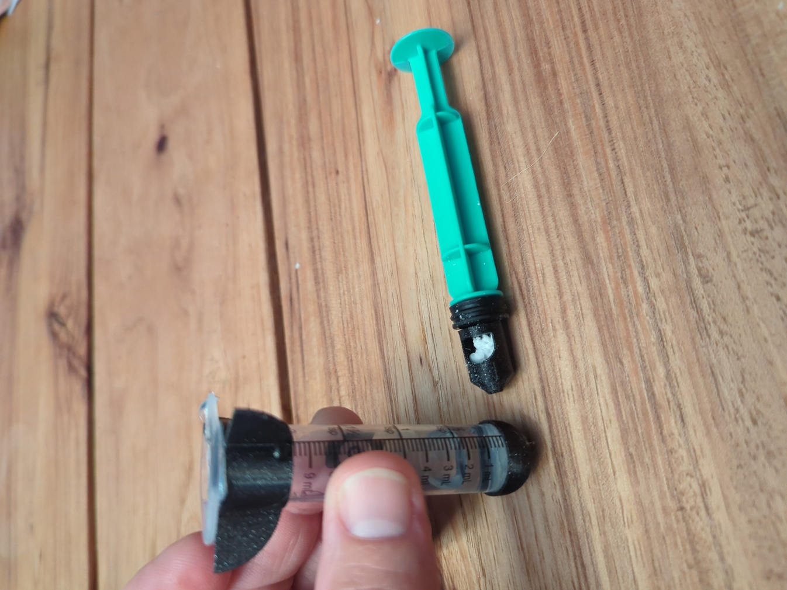
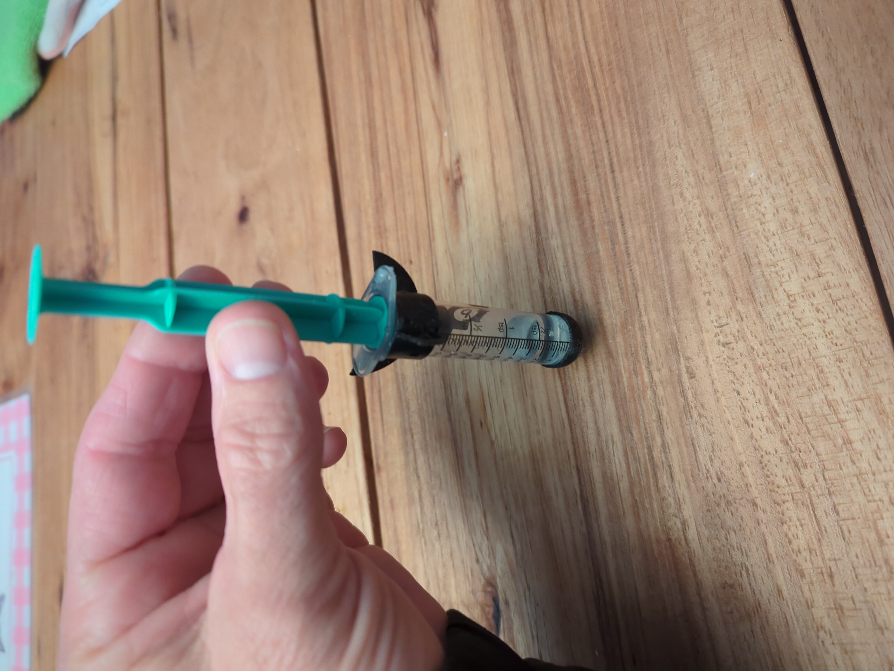
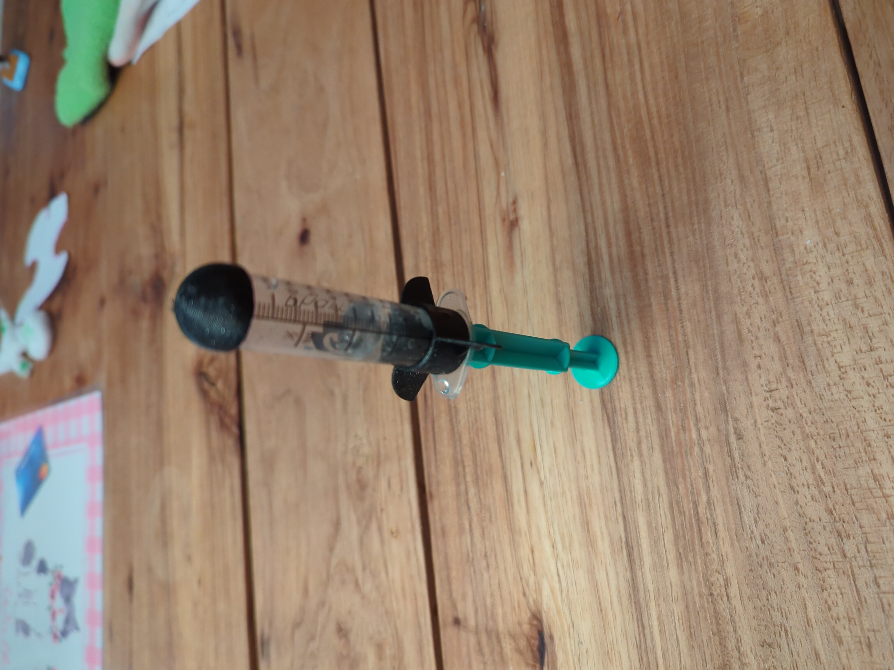
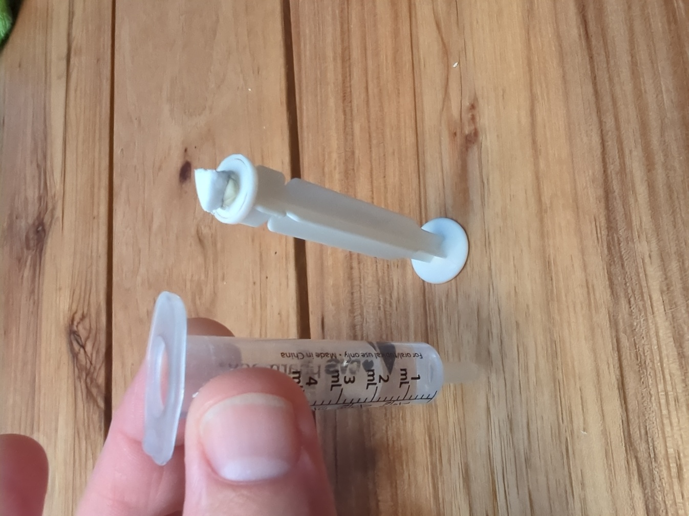
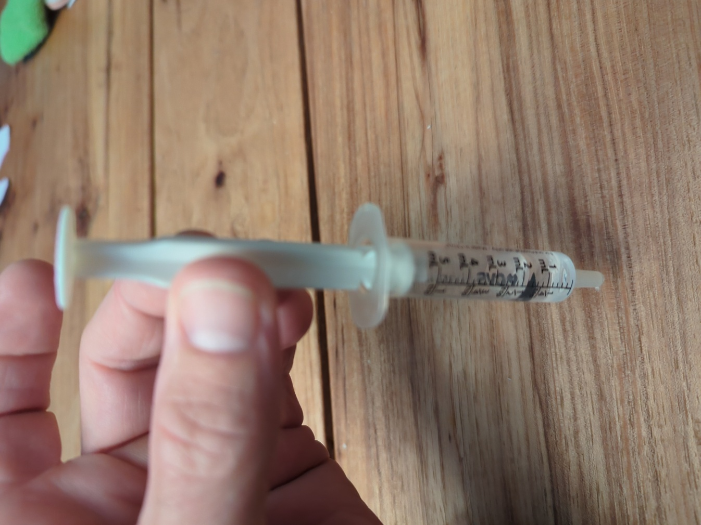
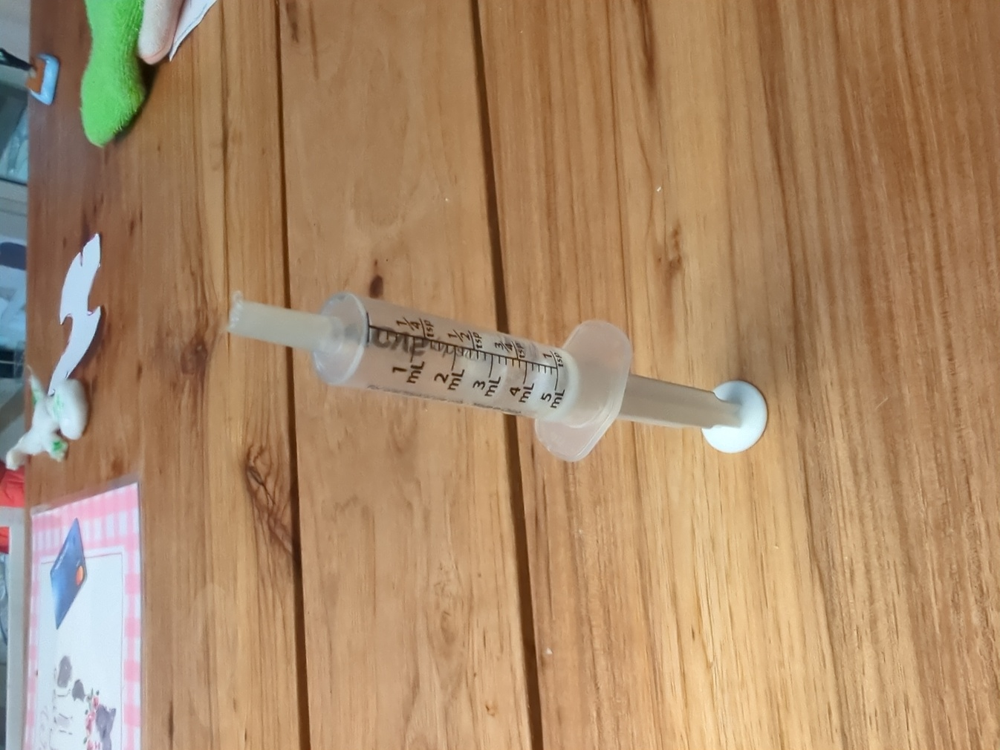

## Materials

1. antacid or vinegar and baking soda
2. syringe and sticky putty/play-doh or pre-built syringe rocket

## Description

- Pre-Built Syringe Rocket

    Either crush an antacid tablet into small pieces or use baking soda.  Load a small amount (less
    than 1/4 teaspoon) of the chosen powder into the chamber on the end of the plunger and hold the
    plunger chamber side down.  If you are using antacid, pour 1-2 ml of water into the rocket body. If
    you are using baking soda, pour 1-2 ml of vinegar into the rocket body.  Insert the plunger into the
    rocket body maintaining it's current orientation as to not spill any of the powder into the liquid.

    
    
    

- Syringe and Sticky Putty

    Use sticky putty or hot glue to plug the small end of the syringe. Break a small (pea sized) chunk
    off of the antacid tablet and use the sticky putty to stick it to the plunger. Pour 1-2 ml of water
    into the syringe body.  Insert the plunger into the syringe body maintaining it's current orientation.

    
    
    

- Launching

    When ready, tip the rocket over, stand it up on a hard, stable surface (table/floor) and back away.
    In 4 to 10 seconds the pressure should build and the rocket will pop off the plunger with enough
    force to likely hit the ceiling.

## Instruction Flyer

   A printable instruction flyer to send home with the kids is located [here](files/rocket_flyer.pdf). 

## 3D Printable Files

    [FreeCAD Design File](rocket.FCStd)
    [rocket nose cone STL](rocket_nose_cone.stl)
    [rocket fins STL](rocket_fins.stl)
    [rocket chamber STL](rocket_chamber.stl)

## Talking Points

- remember the carbon dioxide gas that was pressed into the drink at the factory
- remember the chemical reaction with baking soda and vinegar
- antacid tablets are baking soda and citric acid (vinegar) smashed together in a tablet
- why doesn't it react? it needs a catalyst (heat, light, movement, water)
- we drop the antacid into water which starts the chemical reaction
- the CO2 builds up but has nowhere to go inside the syringe so it makes pressure which launches the rocket
